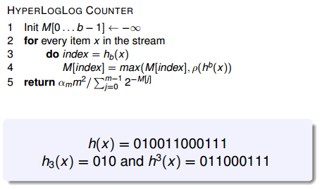
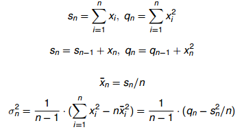
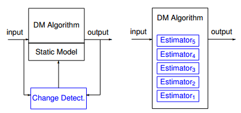

# IOT Stream Data Mining

GALLITELLI Davide - A.Y. 2017/18 @ TELECOM ParisTech

## Goal

These are some notes for the course **IOT Steam Data Mining**, held by prof. BIFET Albert, at TELECOM ParisTech during the second period of the first semester of the 2017/18 academic year.

Ideally, these would comprehend everything explained during the course, as well as some further insight into some of the topics.

Everything in here is based on my understanding of the topic, therefore some things may be explained quickly or not in depth enough.

Enjoy.

## Introduction

In the Big Data world, data is becoming increasingly *huge* and *fast*. This trend will not decrease, but it will become even stronger, considering how IOT devices are becoming mainstream.

Traditional discovery methods of KDDs are based on **batches**: data is read from the input, it's held in memory and a model is built from the memory itself. These methods work pretty well with non-huge datasets, since memory is a constraint even for the biggest of the clusters. IOT devices will flood data centers with new inputs generated continuously and from many different sources. This calls for a new method of handling knowledge discovery.

**Stream mining** proposes a new approach to knowledge discovery, an **incremental** one base on **instances**. Basically, examples are read as soon as they arrive, *one instance at a time, and at most once* and learning is applied to this instance by *updating* the existing model. An instance processes one example at a time, therefore requiring only a *limited amount of memory* and a *limited amount of time*. Furthermore, this new KDD should enable *anytime prediction**, which means that at any time during the learning process I should be able to obtain predictions from the model.


As stated before, due to the speed at which new instances arrive, these examples should be read and analyzed fast, which means never more than once. This implies that we are looking for an **approximation** of the solution, meaning that we want, with high probability (1-*delta*) a small error *epsilon* with respect to the classic batch solution which would require too much time to compute (due to multiple passes over the data). Most of the algorithms have parameters that can be fine tuned so that a certain degree of confidence can be enforced, at the expenses of computation time.

In a nutshell, **stream data mining** comprehends:
- potentially unbounded data (streams can be infinite)
- very fast incoming stream (requiring *at-most-once* read)
- time and memory constrained learning models (should be fast in learning and always reside in main memory)
- anytime prediction (always available model)

Some *application* examples:
- IOT sensor analysis and prediction
- Market/Stock real-time analytics
- Real-time social network mining for sentiment analysis
- Time series prediction

## **Data Stream Algorithms**

In order to allow this *probabilistic* approach to knowledge discovery, some new algorithms are required. Those should guarantee, with a tunable parameter of confidence, certain performances in terms of errors. In general, we are looking for small error rate with high probability, which means mathematically that:
> 

### 8-bit counting: the Morris Approximate Counting Algorithm

The very first time something close to the idea behind *Data Stream Algorithm* has been talked about dates back to 1978 with a paper from Robert Morris named "*Counting Large Numbers of Events in Small Registers*".


The main idea behind it was that, given a 8-bit register, we want to store the highest possible number of numbers, or *events*. With the normal binary system applied to the standard decimal counting, we can store up to *2^8 -1* numbers, or 255 numbers.

If we used instead a logarithmic scale, then the number of events that can be stored in 8 bits would greatly increase:


In order to implement such strategy, Morris came up with the *approximate counting algorithm*:

```
1. Init counter c <- 0
2. for every event in the stream
3. 		do rand = random number between 0 and 1
4. 			if rand < p
5. 				then c <- c + 1
```

where *p* is a parameter of the algorithm.

Basically, the algorithm tries increases the counter with a probability *p*:
- If `p = 2^(-1) = 1/2`, we can store up to `2 x 256` values, with standard deviation `sigma = sqrt(n)/2`.
- If `p = 2^(-c)`, the error of the approximation is `E[2^c] = n+2` with variance `sigma^2 = n(n+1)/2`
- Given a number `b`, if `p = b^(-c)`, then `E[b^c] = n(b-1)+b` with variance `sigma^2 = (b-1)n(n+1)/2`.

### Count-Distinct algorithm: Flajolet-Martin Probabilistic Counting


The **Flajolet–Martin algorithm** is an algorithm for approximating the *number of distinct elements* in a stream with a single pass, exploiting the logarithmic representation seen before. The algorithm was introduced by Philippe Flajolet and G. Nigel Martin in their 1984 article "*Probabilistic Counting Algorithms for Data Base Applications*".

By definition of the problem, we can infer that:
> if the stream contains *n* elements with *m* of them being unique, then the algorithm runs in *O(n)* time and need *O(log(m))* memory.

Given the pseudo-code above, the algorithm is based on a hash function *h(x)* to represent the incoming example. Such hash function maps the example *x* to integers in the range `[0;2*L -1]`, with the outputs being sufficiently uniformly distributed. Then, the *position of the least significant 1-bit* (or, the left-most [\*] bit set to 1) is used to update a bitmap representing the "buckets" of the hash function (which has length `L` and initially contains all `0s`). Finally, the position *b* of the left-most zero in the bitmap is considered. Because it can be stated that, with logarithmic distribution:

> 

> [EN] for me, how this error computation is made is magic. Any help is welcome.

then we return the approximate value given *b* index of the bitmap. Worst case scenario, the error is +-1.12 .

[\*] : everybody knows that the least significant bit should be counted starting from the right. In this example, it was not such a case, bear with it. The concept does not change, only the position in the bitmap would change.

##### Example:

|item x|hash(x)|p(hash(x))|bitmap|
|------|-------|----------|------|
|||||

Let's start with an empty table. The first example incoming is *a*, which is magically-hashed to *0110*. It does not matter how the hashing function generates the binary string, as any can be used.

|item x|hash(x)|p(hash(x))|bitmap|
|------|-------|----------|------|
|a|0110|||

`p(hash(x))` computes the position of the left-most bit set to 1, therefore in this case `p(hash(x)) = 1`. Then, `bitmap[p(hash(x))]` is updated (considering the left-most bit as `bitmap[0]`).

|item x|hash(x)|p(hash(x))|bitmap|
|------|-------|----------|------|
|a|0110|1|0100|

Following the same idea, further examples are handled like this:

|item x|hash(x)|p(hash(x))|bitmap|
|------|-------|----------|------|
|a|0110|1|0100|
|b|1001|0|1100|
|c|0111|1|1100|
|a|0110|1|1100|
|b|1001|0|1100|
|d|1100|0|1100|
|**e**|**0001**|**3**|**1101**|
|f|1010|0|1101|

> [EN] the record in bold chars has been changed from the slides example, to show a third bit switch

With this, we can compute *at any time* the count of unique elements in the stream. Since the left-most bit set to 0 in the bitmap `b = 2`, our estimation of unique numbers `n = (2^b)/0.77351 = 5.17`. The true `n` is 6, but it is still a good approximation.

##### Example 2:

If we had a situation like this:
|item x|hash(x)|p(hash(x))|bitmap|
|------|-------|----------|------|
|a|0110|1|0100|
|a|0110|1|0100|
|a|0110|1|0100|
|e|0001|3|0101|

Then we would obtain:
- `b = 0`
- `n = 2^0 / 0.77351 = 1.29`

##### A modified FM Algorithm

A modified version of the same algorithm used the *max* function instead of a bitmap.


### Count-Distinct: HyperLogLog

The FM algorithm explained above has been refined in "*LogLog counting of large cardinalities*" and "*HyperLogLog: The analysis of a near-optimal cardinality estimation algorithm*".

In this algorithm, the stream is divided in `m = 2^b` substreams, and the estimation uses *harmonic mean*[\*]. This way, the **realtive accuracy** is greater than the *stochastic averaging*[\*\*], and it's equal to `1.04 / sqrt(m)`.



[\*] **Harmonic Mean**: it's one of different kinds of averages, typically used when the average of *rates* is desired. It's the reciprocal of the **arithmetic mean** of the reciprocals of a given set, therefore: `Hm = len(X) / sum(1 / x_i)` where X is the array of examples

[\*\*] **Stochastic Averaging**: when performing `m` experiments in parallel, the standard deviation can be averaged as `st_dev' = st_dev/sqrt(m)`, with relative accuracy of `0.78/sqrt(m)`.

### Frequent Itemset Mining: MAJORITY Algorithm
In the *frequent itemset mining* problem, we are looking to build a dataset of frequent itemset while reading a stream. There are different algorithms to do so.

```
[MAJORITY]
1 Init counter c <- 0
2 for every item s in the stream
3	if counter is zero
4 		then pick up the item
5 	if item is the same
6 		then increment counter
7 	else decrement counter
```

The easiest of them is the **Majority** algorithm, which increments a counter related to the item read from the stream.

### Frequent Itemset Mining: FREQUENT Algorithm

```
[FREQUENT]
1 for every item i in the stream
2 	if item i is not monitored
3 		if < k items monitored
4 			then add a new item with count 1
5 		else if an item z whose count is zero exists
6 			then replace this item z by the new one
7 		else decrement all counters by one
8 	else item i is monitored
9 		increase its counter by one
```

A different version instead is the **Frequent** algorithm, which only keeps monitoring the `k`-most frequent elements. Whenever an example is read from the stream, its counter is updated if it's not new, otherwise, the list of monitored items is updated as specified in the snippet above.

<!-- Example? -->

### Frequent Itemset Mining: LOSSYCOUNTING Algorithm


##### The Class Version

The **LossyCounting** algorithm is based on the concept of periodically removing items with low frequency from the list of monitored items. Every time a new item is read, its counter gets updated

- by 1 if it's an already monitored item
- by 1 + *delta* , where *0 < delta < floor(n/k)*, if it's a new item

Once the update is done, then the counters are all decremented by one, and the elements with frequency equal to zero are removed.

##### The Paper/Internet Version

The main concept is still the same, but the idea is to divide the stream into *windows* ([EN] maybe n/k?). Every time a new window is read, the counter for the item is updated by the frequency in the window. Once the full window is read, then all counters are decremented by one. The algorithm is then iterated until the end of the stream.

The new algorithm would more or less look like so:

```
[CUSTOM LOSSYCOUNTING]
1 	define window size W
2	define window counter C
3 	for every item i in the stream S
4 		increase counter of item i by 1 (or add new item with count 1)
5		increase C by 1
6		if C = W
7			decrement all counters by 1
8			remove items with 0 count
9 			reset C to 0
```

The actual count of each item depend on the window size. Still, it is possible to find the same frequent itemset; if `stream-size = N` and `window-size = W = 1/e`, then the **frequency error** is `f_e = eN`.

##### Example:

Let's apply the LOSSYCOUNTING algorithm to the following stream:

|a|b|c|d|a|c|a|a|a|c|d|c|a|a|c|b|
|-|-|-|-|-|-|-|-|-|-|-|-|-|-|-|-|

`STEP 0`

Let's define a window size `W = 4` (since we have 16 elements, this way the example is easier). At the beginning, the window counter is `C = 0`.

`STEP 1`

The first window to be analyzed is:

|a|b|c|d|
|-|-|-|-|

All of them are new items, therefore the *frequent itemset list* becomes, before decrementing it:

|a|b|c|d|
|-|-|-|-|
|1|1|1|1|

Since we reached window boundary, all counters are decremented by one:

|a|b|c|d|
|-|-|-|-|
|0|0|0|0|

All items are dropped from the list.

`STEP 2`

|a|c|a|a|
|-|-|-|-|

The itemset list becomes:

|a|c|
|-|-|
|3|1|

After the update:

|a|
|-|
|2|

`STEP 3`

|a|c|d|c|
|-|-|-|-|

The itemset list becomes:

|a|c|d|
|-|-|-|
|3|2|1|

After the update:

|a|c|
|-|-|
|3|2|

`STEP 4`

|a|a|c|b|
|-|-|-|-|

The itemset list becomes:

|a|c|b|
|-|-|-|
|5|3|1|

After the update:

|a|c|
|-|-|
|4|2|

For this example, we have `stream-size = N = 16` and `window-size = W = 4 = 1/e --> e = 1/4 = 0.25`, the `frequency error = f_e = 16*0.25 = 4`.

##### Example 2:

What if, with the same stream, we changed to window size to something like *8*?

|a|b|c|d|a|c|a|a|a|c|d|c|a|a|c|b|
|-|-|-|-|-|-|-|-|-|-|-|-|-|-|-|-|

`STEP 0`

Let's define a window size `W = 8`. At the beginning, the window counter is `C = 0`.

`STEP 1`

|a|b|c|d|a|c|a|a|
|-|-|-|-|-|-|-|-|

The itemset list becomes:

|a|b|c|d|
|-|-|-|-|
|4|1|2|1|

After the update:

|a|c|
|-|-|
|3|1|

`STEP 2`

|a|c|d|c|a|a|c|b|
|-|-|-|-|-|-|-|-|

The itemset list becomes:

|a|c|d|b|
|-|-|-|-|
|6|4|1|1|

After the update:

|a|c|
|-|-|
|5|3|

For this example, we have `stream-size = N = 16` and `window-size = W = 8 = 1/e --> e = 1/8 = 0.125`, the `frequency error = f_e = 16*0.125 = 2`.

### Frequent Itemset Mining: SPACE SAVING Algorithm


**Space Saving** can be considered as a merge of *LossyCounting* and *Frequent* algorithms. Instead of dropping low count items, just like in the *LossyCounting* algorithm, the **Space Saving** algorithm replaces the item with the lowest counter with the just found not monitored item, and then increments its counter by 1.

##### Example:

Let's suppose that we have an itemset count as such:

|a|b|c|
|-|-|-|
|7|5|3|

then, we read input `d`. The itemset list has reached maximum capacity (set before starting). What happens? The `d` input replaces the item with the lowest count, which is `c`. The itemset list becomes:

|a|b|d|
|-|-|-|
|7|5|4|

### Frequent Itemset Mining: COUNT-MIN SKETCH Algorithm

The counter algorithms analyzed until now only handle the “*arrivals only*” model, not the “**arrivals and departures**” one. This means that, if there is a case of "negative frequency", the previous algorithms do not have a deterministic solution. Sketch algorithms compute a summary that is a linear transform of the frequency vector.

The **COUNT-MIN** algorithm is one of such algorithms. It uses a two-dimensional array with width `w = ceil(e/epsilon)` and depth `d = ceil(ln(1/delta))`, where both *epsilon* and *delta* are user-given parameters which tune the performances of the algorithm, since the depth represents also the **update time** of the algorithm (the time it takes to read the column/array of values). NB: `e` in the width formula is the Euler's number `e = 2.718281`.


In a nutshell, CM-Sketch computes frequency data adding and removing real values. Every time it reads an input `(j,+c)`, where `c` is a real value, for each row `i` of the table, apply the corresponding *hash function* `h_i` to obtain a column index `k = h_i(j)`. Then increment the value in `j,k` (with `j = [1...d]` and `k = [1...w]`) by `+c`. In order to compute the frequency `f` then, it is as simple as computing the minimum of those updated values, which means `f = min[i,h_i(j)]`.

Given the *epsilon* parameter, it is guaranteed that this algorithm provides a frequency `f <= f_r + epsilon*N`, where `f_r` is the real frequency and `N` is the stream size.

### Reservoir Sampling

Finally, given a data stream `X`, we want to choose `k` items with the same probability,
storing only `k` elements in memory.

```
[RESERVOIR SAMPLING]
1 	for every item i in the first k items of the stream
2 		store item i in the reservoir
3 	n <- k
4 	for every item i in the stream after the first k items of the stream
5 		select a random number r between 1 and n
6 		if r < k
7 			then replace item r in the reservoir with item i
8 		n = n + 1
```

### The problem of MEAN and VARIANCE

Given a data stream X, computing statistics such as **mean** or **variance** loses part of the meaning: these computations have to be done on a *sliding window* of `n` element, since mean and variance are based on the division operator and therefore is not cumulative.



We can maintain simple statistics over sliding windows, using `O(1/epsilon * log^2(N))` space, where:
- `N` is the length of the sliding window
- `epsilon` is the accuracy parameter

### Exponential Histograms

<!-- WHAT -->


<!-- ## **Concept Drift** -->

<!--  -->
